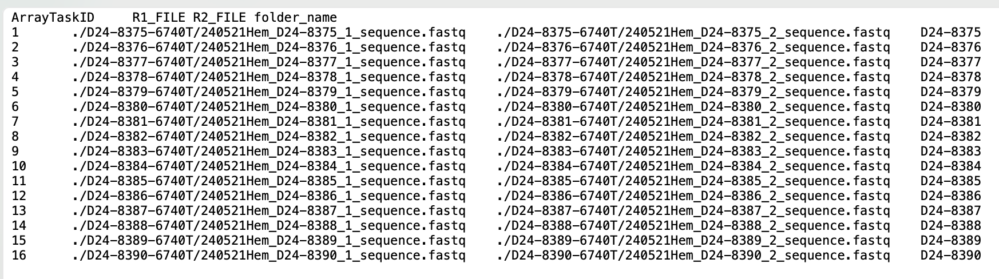
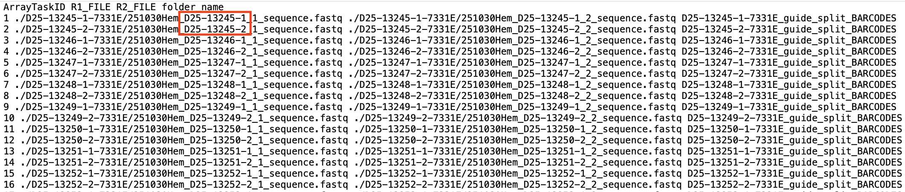
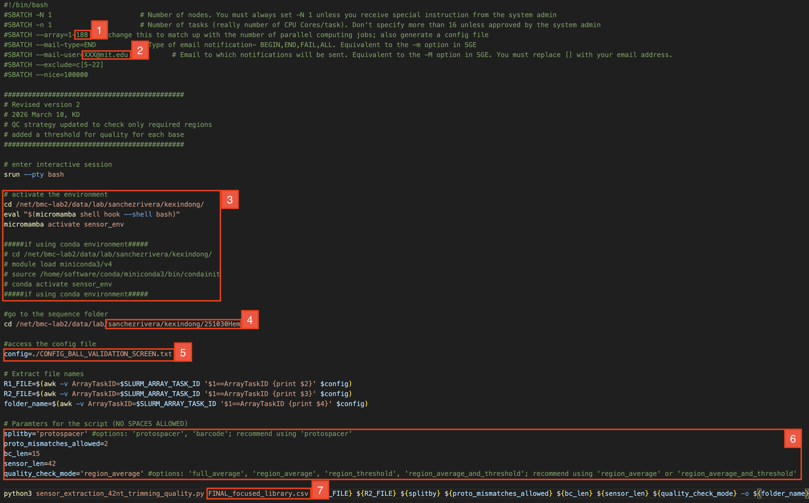
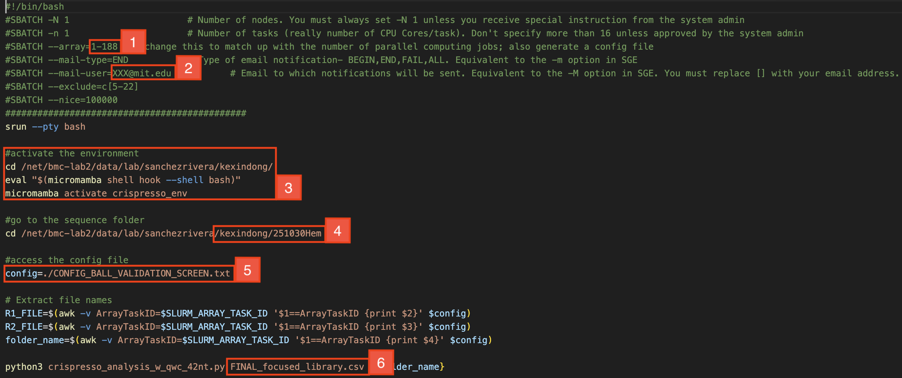

# fsrlab-sensor-analysis

NGS sensor analysis pipeline for base editing and prime editing screens.

**Contributors:** Kexin Dong, Sam Gould
**Last updated:** May 20, 2026

## What's new in this version

- (For first-time user of the pipeline) Use micromamba to replaces conda for env management on the cluster, which is way faster.
- Detailed instructions on how to deal with samples with duplicated NGS lanes.
- Sensor extraction rewritten with trimming and revised QC strategies, so that only required regions are checked, with optional per-base quality thresholds.
- Sensor extraction rewritten for prime editing screen analysis.
- Updated LFC calculation with more comprehensive information for downstream analysis.

## How to use

1. Clone this repo locally.
2. Follow the steps below in order.

---

## Sequencing strategy

Based on paired-end sequencing where **R1 = Sensor_Read** and **R2 = Protospacer_Read**:


**This pipeline must be modified to work with alternative sequencing strategies.**

---

## STEP 1 — Download NGS data

[`NGS-scripts/STEP1_download_data/STEP1_download_data.sh`](NGS-scripts/STEP1_download_data/STEP1_download_data.sh)

Cheatsheet of commands. 

Log into Luria, start an interactive session, then `rsync` the sequencing core's data into your lab folder:

```bash
ssh youraccount@luria.mit.edu
srun --pty bash
cd /net/bmc-lab2/data/lab/sanchezrivera/$USER/
srun rsync -av /net/bmc-pub17/data/bmc/public/datahub/datafolder \
               /net/bmc-lab2/data/lab/sanchezrivera/$USER/
```

$USER = the name of your existing folder on the cluster; this step won't work otherwise.

Also replace the source path with the one provided in the sequencing core email.

---

## STEP 2 — Create micromamba environments

[`NGS-scripts/STEP2_conda_env/02_create_start_env.sh`](NGS-scripts/STEP2_conda_env/02_create_start_env.sh)

In order to run these scripts, you need to create 2 conda/micromamba environments. Conda/micromamba  environments are essentially sandboxes that allow python scripts to run while referencing all of their required packages/package versions. These environments allow the scripts to run on the cluster, otherwise you would get errors of "package not installed" when trying to import the packages.

A lot of us have had trouble configuring conda environments on the cluster — solver runs that hang for hours, mysterious dependency conflicts, and envs that take forever to create. I switched to **micromamba** here because it's a drop-in replacement that uses the same `.yml` spec files but resolves and installs environments dramatically faster (often minutes instead of hours). If you've never set it up before, the one-time install commands at the top of `02_create_start_env.sh` will get you going; skip them if already installed.

Two micromamba envs will be needed:

| Env | Used in | Spec file |
| --- | --- | --- |
| `sensor_env`     | STEP4 (sensor extraction)            | [`sensor_env.yml`](NGS-scripts/STEP2_conda_env/sensor_env.yml) |
| `crispresso_env` | STEP5 (sensor analysis), STEP6 (sensor aggregation) | [`crispresso_env.yml`](NGS-scripts/STEP2_conda_env/crispresso_env.yml) |

To create these environments, **copy these .yml files to your own folder on the server** (I recommend generating a "conda_envs" folder to store all the .yml files), and then run the commands in [`NGS-scripts/STEP2_conda_env/02_create_start_env.sh`](NGS-scripts/STEP2_conda_env/02_create_start_env.sh) by copying lines as commands manually.

To login cluster:
```bash
srun --pty bash
cd /net/bmc-lab2/data/lab/sanchezrivera/$USER/
```
$USER = the name of your existing folder on the cluster.

To install micromamba (skip if already installed):

```bash
mkdir ~/micromamba
curl -Ls https://micro.mamba.pm/install.sh | bash -s -- -b -u -p ~/micromamba
echo 'export PATH=$HOME/micromamba/bin:$PATH' >> ~/.bashrc
source ~/.bashrc
```

To create environments:
```bash
micromamba create -n sensor_env     -f ./conda_envs/sensor_env.yml
micromamba create -n crispresso_env -f ./conda_envs/crispresso_env.yml
```
To activate environments:
```bash
micromamba activate crispresso_env
micromamba activate sensor_env
```

---

## STEP 3 — Generate config file & library file

[`NGS-scripts/STEP3_generate_config_file/03_generate_config_file.ipynb`](NGS-scripts/STEP3_generate_config_file/03_generate_config_file.ipynb)

### Config file

The power of the cluster is that we can run jobs for each of the different samples at the same time, which drastically speeds things up. To do so, we must first generate a config file that provides information about the relevant files so that they can be processed by the python scripts. 

To generate config files, follow the Jupyter Notebook above.

The config file is tab/space-separated `.txt` with 4 columns (one row per sample, `ArrayTaskID` numbered from 1):

| Column | Description |
| --- | --- |
| `ArrayTaskID` | 1, 2, 3, … matches `--array=1-N` in the sbatch scripts |
| `R1_FILE`     | relative path to R1 fastq |
| `R2_FILE`     | relative path to R2 fastq |
| `folder_name` | output folder name for this sample |

Here’s an example of what a config file looks like:



Note that if your NGS is processed with two lane per sample, you will have two `.fastq` files per sample. So instead, the config file would look like:



We will proceed these .fastq files of duplicated lanes seperately and combine them at counts level later.

An example is also included as `CONFIG_BALL_VALIDATION_SCREEN.txt` in the folder of STEP3.

### Library file

You’ll also need to have the library file with the proper column names:

| `gRNA_id` | `Protospacer` | `Hamming_BC` | `sensor_wt` | `sensor_alt` |
| --- | --- | --- | --- | --- |

Follow the Jupyter Notebook above to check you have proper columns included and correct names for them before proceeding forward.

---

### Actions before running STEP4

In your **sequencing folder on the cluster**,

- Check the length of sensor and the length of barcode of your library by following [`03_generate_config_file.ipynb`](NGS-scripts/STEP3_generate_config_file/03_generate_config_file.ipynb);
- Add the **config file** and **library file**;
- Create these **4 sub-folders** **(names must be exact, lowercase)**:

1. `classification`
2. `confusion_mats`
3. `counts`
4. `crispresso`

### Note

Step 4 - 6 will be run on the cluster. For each step, there is a python script and a corresponding `.sh` script that provides instructions to the cluster about which samples to run analysis on/where these files are located. Do not modify the Python script. **The only thing you will need to edit are these .sh scripts.**

---

## STEP 4 — Sensor extraction & guide counts

[`NGS-scripts/STEP4_sensor_extraction/`](NGS-scripts/STEP4_sensor_extraction/)

This step (A) filters low-quality reads, (B) counts guides, and (C) splits sensor reads into per-guide fastq files. 

You'll notice two versions of the extraction script:

| Script | QC strategy |
| --- | --- |
| `sensor_extraction_42nt`                 | Averages quality over the full read (original SG version) |
| `sensor_extraction_42nt_trimming_quality`| Region-specific checks + optional per-base threshold (KD, 2026-03-10) |

The revised version was added to fix a QC problem with the original. The OG only looks at the average quality of the whole read, but we've noticed the sequencing center sometimes doesn't trim extra sequences properly — which under the OG strategy throws away perfectly usable reads. The revised `sensor_extraction_42nt_trimming_quality` lets you QC only the regions you actually care about (barcode + sensor).

The OG version is fine for most cases, but I'd recommend switching to the revised one for future screens.

### Editing
Whichever you choose, you need to edite`.sh` script as follows:



1. This needs to match up with the number of samples you’re running. E.g if your config file runs from 1-10, set this to 1-10.
2. Change it to your email!
3. Choose conda or micromamba to match what you use and change the env path to yours to activate the environment.
4. Set this path to match up with the folder where your sequencing data is stored.
5. Set this to match up with your config file name with the prefix “./”
6. These are parameters for the run.
    - **splitby** = whether to split sensors into separate fastq files by the protosapcer identity or the barcode identity 
        - Options: 'protospacer' or 'barcode'.
        - Recommend 'protospacer'.
    - **proto_mismatches_allowed** = # of protospacer mismatches allowed when performing counts.
    - **bc_len** = length of barcode (normally 15 nt).
    - **sensor_len** = length of sensor (normally 42 nt).
    - **quality_check_mode (revised version only)** = how to drop out low quality reads. Phred threshold is 30 by default.
        - Options:
            - 'full_average': averages Phred quality across the **entire** R1 and R2 reads, and drops the read if either average falls below threshold. This is the original SG behavior — strict, but discards reads when untrimmed flanking sequence drags the average down.
            - 'region_average': averages Phred quality only over the **regions actually used downstream** (barcode + sensor in R1, protospacer in R2). Flanking junk no longer affects the call.
            - 'region_average_and_threshold': same region-restricted averaging as above, **plus** two extra per-base checks: (a) no single base in the **barcode region** may fall below Phred 30 (any single bad base in the barcode → drop, because barcode errors break guide assignment), and (b) no more than 5 bases in the required regions may fall below Phred 20. This is the strictest mode.
        - Recommend `'region_average'` for most runs, or `'region_average_and_threshold'` when barcode-assignment accuracy is critical.
7. Change the library filename to match up with the name that you’ve given to the file.


### Add to cluster
Once this is done, add this (1) **sensor_extraction_42nt_trimming_quality.sh** to your sequencing folder, along with (2) **sensor_extraction_42nt_trimming_quality.py**.


### Submit
Finally, run the cluster command to execute this script by logging into the cluster and running the command in [`RUN_THIS.sh`](NGS-scripts/STEP4_sensor_extraction/RUN_THIS.sh).

```
cd $LABROOT/<sequencing_folder>
sbatch sensor_extraction_42nt_trimming_quality.sh
```

### Step 4 for prime editing screen analysis

For **prime editing** screens we use separate scripts, especially for this step. See [`NGS-scripts-prime-editing/`](NGS-scripts-prime-editing/) for scripts and examples.

In earlier PE analyses we saw an unusually high rate of barcode–protospacer recombination. To improve barcode specificity, the matched barcode is extended by **8 nt** into the sensor sequence — i.e. the script matches reads against a **16 nt** `Hamming_BC` (the original 8 nt BC + the first 8 nt of the sensor), while the actual sensor extracted into the per-guide fastq still starts at position 8 (`real_bc_len`). This gives more discriminating power without losing any sensor content downstream.

#### Editing the PE `.sh`

Same fields as the BE version, plus two PE-specific ones:

- **bc_len** = length of the extended barcode used for matching (normally `16` for PE)
- **real_bc_len** = where the sensor actually starts in R1 (normally `8` — the overlap region between BC and sensor)
- **sensor_len** = length of the sensor extracted into per-guide fastq (normally `55` for PE)
- **quality_check_mode** = `'full_average'`, `'region_average'`, or `'region_average_and_threshold'` (same semantics as above; region check covers `[:bc_len + sensor_len]` in R1)

Library file must contain the `pegRNA_id` column.

#### Submit

```bash
cd $LABROOT/<sequencing_folder>
sbatch sensor_extraction_peg_counts_ext_bc_16nt.sh
```
---

## STEP 5 — CRISPResso sensor analysis

[`NGS-scripts/STEP5_sernsor_analysis/`](NGS-scripts/STEP5_sernsor_analysis/)

This step runs CRISPResso on each per-guide fastq from STEP4.

### Edit
Edit [`crispresso_analysis_42nt.sh`](NGS-scripts/STEP5_sernsor_analysis/crispresso_analysis_42nt.sh).



1. This needs to match up with the number of samples you’re running. E.g if your config file runs from 1-10, set this to 1-10.
2. Change it to your email!
3. Choose conda or micromamba to match what you use and change the env path to yours to activate the environment.
4. Set this path to match up with the folder where your sequencing data is stored.
5. Set this to match up with your config file name with the prefix “./”
6. Change the library filename to match up with the name that you’ve given to the file.

### Add to cluster
Once this is done, add this (1) **crispresso_analysis_42nt.sh** to your sequencing folder, along with (2) **crispresso_analysis_w_qwc_42nt.py**.

### Submit
Finally, run the cluster command to execute this script by logging into the cluster and running the command in [`RUN_THIS.sh`](NGS-scripts/STEP5_sensor_analysis/RUN_THIS.sh).

```bash
cd $LABROOT/<sequencing_folder>
sbatch crispresso_analysis_42nt.sh
```

**Note**: if CRISPResso errors on folder permissions, fix with:

```bash
chmod -R g+w /net/bmc-lab2/data/lab/sanchezrivera/$USER/<your_run>/crispresso
```

---

## STEP 6 — CRISPResso aggregation

[`NGS-scripts/STEP6_sensor_aggregation/`](NGS-scripts/STEP6_sensor_aggregation/)

This step aggregates per-guide CRISPResso outputs into one dataframe per sample.

### Edit


### Add to the cluster
You must add **all three** files to your sequencing folder:

1. `crispresso_analysis_aggregation.sh`
2. `crispresso_analysis_aggregation.py`
3. `crispresso_quant_blank.csv` — **the script will fail without it**

### Submit
Finally, run the cluster command to execute this script by logging into the cluster and running the command in [`RUN_THIS.sh`](NGS-scripts/STEP6_sensor_aggregation/RUN_THIS.sh).

```bash
cd $LABROOT/<your_run>
sbatch crispresso_analysis_aggregation.sh
```

---

## STEP 7 — Compile CRISPResso results

[`NGS-scripts/STEP7_crispresso_compiler/compiling_crispresso.ipynb`](NGS-scripts/STEP7_crispresso_compiler/compiling_crispresso.ipynb)

Local (post-cluster) notebook. Compiles the per-sample CRISPResso aggregates from STEP6 into a single editing-outcome table, merges NGS technical replicates, and supports ABE/CBE × BC/EPO splits.

> Tip: copy only the `.csv` files out of the cluster `crispresso/` folder — do not pull the whole folder.

---

## STEP 8 — Counts matrix & MAGeCK

[`NGS-scripts/STEP8_counts_and_MaGeCk/mageck.ipynb`](NGS-scripts/STEP8_counts_and_MaGeCk/mageck.ipynb)

Local notebook. Builds a count matrix (samples × guides) from STEP4 counts and feeds it into MAGeCK for normalization, LFC, and FDR.

**Important:** when building ABE-only or CBE-only sub-pool files, keep only the matching guides.

Example MAGeCK call:

```bash
source activate mageckenv
mageck test \
  -k guide_counts.txt \
  -t tf_rep1,tf_rep2,tf_rep3 \
  -c t0_rep1,t0_rep2,t0_rep3 \
  --normcounts-to-file \
  -n my_analysis
```

`-t` = treatment columns, `-c` = control columns, `-n` = output prefix. The main result is `*.sgrna_summary.txt`. Docs: https://sourceforge.net/p/mageck/wiki/Home/

---

## Output reference

After STEP4 finishes, your sequencing folder contains four sub-folders:

### `classification/`
Per-sample read-quality and protospacer/barcode-identification breakdown.

| Column | Description |
| --- | --- |
| `good_quality`              | reads above quality threshold |
| `low_qual_r1`               | R1 below threshold (excluded) |
| `low_qual_r2`               | R2 below threshold (excluded) |
| `low_qual_r12`              | both R1 and R2 below threshold (excluded) |
| `no_match_bc`               | good-quality reads with no barcode match |
| `bc_identified`             | good-quality reads with barcode identified |
| `proto_identified_perfect`  | good-quality reads, protospacer with 0 mismatches |
| `proto_identified_imperfect`| good-quality reads, protospacer within allowed mismatches |
| `proto_identified_recombined`| good-quality reads, protospacer identified but barcode mismatch (recombination event) |
| `no_match_proto`            | good-quality reads, no protospacer identified |

### `confusion_mats/`
Recombination matrix between protospacer and barcode (diagnostic).

### `counts/`
Per-sample guide and barcode counts.

| Column | Description |
| --- | --- |
| `Guide_ID`            | guide name |
| `sgRNA_no_Gstart`     | protospacer |
| `unique_BC`           | barcode |
| `total_guide_count`   | total protospacer count (incl. recombination) |
| `matched_guide_count` | reads with matched protospacer-barcode pairs |
| `bc_count`            | total barcode count (incl. recombination) |
| `duplicate_sgRNA`     | TRUE if guide appears more than once in the library |

Run MAGeCK on either `matched_guide_count` (more stringent) or `bc_count` (higher counts).

### `crispresso/`
Per-guide CRISPResso editing outcomes. Aggregated by STEP6, compiled by STEP7.