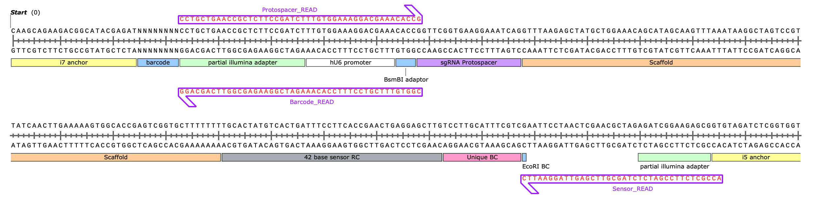

# fsrlab-sensor-analysis

NGS sensor analysis pipeline.

**Contributors:** Kexin Dong, Sam Gould
**Last updated:** May 20, 2026

## What's new in this version

- (For first-time user of the pipeline) Use micromamba to replaces conda for env management on the cluster, which is way faster.
- Detailed instructions on how to deal with samples with duplicated NGS lanes.
- Sensor extraction rewritten with trimming and revised QC strategies, so that only required regions are checked, with optional per-base quality thresholds.
- Updated LFC calculation with more comprehensive information for downstream analysis.

## How to use

1. Clone this repo locally.
2. Follow the steps below in order.

---

## Sequencing strategy

Based on paired-end sequencing where **R1 = Sensor_Read** and **R2 = Protospacer_Read**:



**This pipeline must be modified to work with alternative sequencing strategies.**

---

## STEP 1 — Download sequencing data

[`NGS-scripts/STEP1_download_data/STEP1_download_data.sh`](NGS-scripts/STEP1_download_data/STEP1_download_data.sh)

Cheatsheet of commands. Log into Luria, start an interactive session, then `rsync` the sequencing core's data into your lab folder:

```bash
ssh youraccount@luria.mit.edu
srun --pty bash
cd /net/bmc-lab2/data/lab/sanchezrivera/$USER/
srun rsync -av /net/bmc-pub17/data/bmc/public/datahub/datafolder \
               /net/bmc-lab2/data/lab/sanchezrivera/$USER/
```

Replace the source path with the one provided in the sequencing core email.

---

## STEP 2 — Create micromamba environments

[`NGS-scripts/STEP2_conda_env/02_create_start_env.sh`](NGS-scripts/STEP2_conda_env/02_create_start_env.sh)

Two micromamba envs are needed:

| Env | Used in | Spec file |
| --- | --- | --- |
| `sensor_env`     | STEP4 (sensor extraction)            | [`sensor_env.yml`](NGS-scripts/STEP2_conda_env/sensor_env.yml) |
| `crispresso_env` | STEP5 (analysis), STEP6 (aggregation) | [`crispresso_env.yml`](NGS-scripts/STEP2_conda_env/crispresso_env.yml) |

`02_create_start_env.sh` is a cheatsheet — copy lines as commands manually. `$USER` should be replaced by your working directory. I switched from conda to micromamba here because it's typically WAY faster. One-time micromamba install commands are included; skip them if already installed.

```bash
micromamba create -n sensor_env     -f ./conda_environment_configuration_file/sensor_env.yml
micromamba create -n crispresso_env -f ./conda_environment_configuration_file/crispresso_env.yml
```

---

## STEP 3 — Generate config file & library file

[`NGS-scripts/STEP3_generate_config_file/03_generate_config_file.ipynb`](NGS-scripts/STEP3_generate_config_file/03_generate_config_file.ipynb)

Use this notebook to build the per-sample config file the cluster array jobs read from. An example is included as `CONFIG_BALL_VALIDATION_SCREEN.txt`.

### Config file

Tab/space-separated `.txt` with 4 columns (one row per sample, `ArrayTaskID` numbered from 1):

| Column | Description |
| --- | --- |
| `ArrayTaskID` | 1, 2, 3, … matches `--array=1-N` in the sbatch scripts |
| `R1_FILE`     | relative path to R1 fastq |
| `R2_FILE`     | relative path to R2 fastq |
| `folder_name` | output folder name for this sample |

Save with `df.to_csv('config_file.txt', sep=' ', index=False)`.

### Library file

Columns required (matches `pegg.base`):

| `gRNA_id` | `Protospacer` | `Hamming_BC` | `sensor_wt` | `sensor_alt` |
| --- | --- | --- | --- | --- |

- **gRNA_id** — unique guide identifier
- **Protospacer** — G+19 protospacer (includes the leading "G")
- **Hamming_BC** — sensor barcode (typically 15 nt)
- **sensor_wt** — wildtype 42 nt sensor sequence
- **sensor_alt** — correctly edited 42 nt sensor sequence

### Before running STEP4

Add the config file + library file to your sequencing folder, and create these **4 sub-folders** (names must be exact, lowercase):

1. `classification`
2. `confusion_mats`
3. `counts`
4. `crispresso`

---

## STEP 4 — Sensor extraction & guide counts

[`NGS-scripts/STEP4_sensor_extraction/`](NGS-scripts/STEP4_sensor_extraction/)

Uses **`sensor_env`**. Filters low-quality reads, counts guides, and splits sensor reads into per-guide fastq files. Three variants of the sbatch script are provided — pick one based on how strict the QC should be:

| Script | QC strategy |
| --- | --- |
| `sensor_extraction_42nt.sh`                 | Baseline (original Sam Gould version) |
| `sensor_extraction_42nt_trimming.sh`        | Revised v1 — checks only required regions (KD, 2026-03-10) |
| `sensor_extraction_42nt_trimming_quality.sh`| Revised v2 — region checks + per-base quality threshold (KD, 2026-03-10) |

Background and rationale for the QC strategies are in [`sensor_extraction_guideline.ipynb`](NGS-scripts/STEP4_sensor_extraction/sensor_extraction_guideline.ipynb).

### Edit before submitting

In whichever `.sh` you pick:

1. `--array=1-N` — match the number of samples in your config
2. `--mail-user` — your email
3. `cd ...` — path to your sequencing folder
4. `config=` — your config filename
5. Parameters: `splitby`, `proto_mismatches_allowed`, `bc_len`, `sensor_len` (and `quality_check_mode` for v2)
6. Library file name in the final `python3` line

### Submit

```bash
cd $LABROOT/<your_run>
sbatch sensor_extraction_42nt.sh         # or _trimming.sh / _trimming_quality.sh
```

`RUN_THIS.sh` is a one-liner shortcut that does `cd` + `sbatch` together.

---

## STEP 5 — CRISPResso sensor analysis

[`NGS-scripts/STEP5_sernsor_analysis/`](NGS-scripts/STEP5_sernsor_analysis/)

Uses **`crispresso_env`**. Runs CRISPResso on each per-guide fastq from STEP4.

Edit [`crispresso_analysis_42nt.sh`](NGS-scripts/STEP5_sernsor_analysis/crispresso_analysis_42nt.sh): same fields as STEP4 (`--array`, `--mail-user`, `cd`, `config`, library file name).

```bash
cd $LABROOT/<your_run>
sbatch crispresso_analysis_42nt.sh
```

**Heads-up:** if CRISPResso errors on folder permissions, fix with:

```bash
chmod -R g+w /net/bmc-lab2/data/lab/sanchezrivera/$USER/<your_run>/crispresso
```

---

## STEP 6 — CRISPResso aggregation

[`NGS-scripts/STEP6_sensor_aggregation/`](NGS-scripts/STEP6_sensor_aggregation/)

Uses **`crispresso_env`**. Aggregates per-guide CRISPResso outputs into one dataframe per sample.

You must add **all three** files to your sequencing folder:

1. `crispresso_analysis_aggregation.sh`
2. `crispresso_analysis_aggregation.py`
3. `crispresso_quant_blank.csv` — **the script will fail without it**

```bash
cd $LABROOT/<your_run>
sbatch crispresso_analysis_aggregation.sh
```

---

## STEP 7 — Compile CRISPResso results

[`NGS-scripts/STEP7_crispresso_compiler/compiling_crispresso.ipynb`](NGS-scripts/STEP7_crispresso_compiler/compiling_crispresso.ipynb)

Local (post-cluster) notebook. Compiles the per-sample CRISPResso aggregates from STEP6 into a single editing-outcome table, merges NGS technical replicates, and supports ABE/CBE × BC/EPO splits.

> Tip: copy only the `.csv` files out of the cluster `crispresso/` folder — do not pull the whole folder.

---

## STEP 8 — Counts matrix & MAGeCK

[`NGS-scripts/STEP8_counts_and_MaGeCk/mageck.ipynb`](NGS-scripts/STEP8_counts_and_MaGeCk/mageck.ipynb)

Local notebook. Builds a count matrix (samples × guides) from STEP4 counts and feeds it into MAGeCK for normalization, LFC, and FDR.

**Important:** when building ABE-only or CBE-only sub-pool files, keep only the matching guides.

Example MAGeCK call:

```bash
source activate mageckenv
mageck test \
  -k guide_counts.txt \
  -t tf_rep1,tf_rep2,tf_rep3 \
  -c t0_rep1,t0_rep2,t0_rep3 \
  --normcounts-to-file \
  -n my_analysis
```

`-t` = treatment columns, `-c` = control columns, `-n` = output prefix. The main result is `*.sgrna_summary.txt`. Docs: https://sourceforge.net/p/mageck/wiki/Home/

---

## Output reference

After STEP4 finishes, your sequencing folder contains four sub-folders:

### `classification/`
Per-sample read-quality and protospacer/barcode-identification breakdown.

| Column | Description |
| --- | --- |
| `good_quality`              | reads above quality threshold |
| `low_qual_r1`               | R1 below threshold (excluded) |
| `low_qual_r2`               | R2 below threshold (excluded) |
| `low_qual_r12`              | both R1 and R2 below threshold (excluded) |
| `no_match_bc`               | good-quality reads with no barcode match |
| `bc_identified`             | good-quality reads with barcode identified |
| `proto_identified_perfect`  | good-quality reads, protospacer with 0 mismatches |
| `proto_identified_imperfect`| good-quality reads, protospacer within allowed mismatches |
| `proto_identified_recombined`| good-quality reads, protospacer identified but barcode mismatch (recombination event) |
| `no_match_proto`            | good-quality reads, no protospacer identified |

### `confusion_mats/`
Recombination matrix between protospacer and barcode (diagnostic).

### `counts/`
Per-sample guide and barcode counts.

| Column | Description |
| --- | --- |
| `Guide_ID`            | guide name |
| `sgRNA_no_Gstart`     | protospacer |
| `unique_BC`           | barcode |
| `total_guide_count`   | total protospacer count (incl. recombination) |
| `matched_guide_count` | reads with matched protospacer-barcode pairs |
| `bc_count`            | total barcode count (incl. recombination) |
| `duplicate_sgRNA`     | TRUE if guide appears more than once in the library |

Run MAGeCK on either `matched_guide_count` (more stringent) or `bc_count` (higher counts).

### `crispresso/`
Per-guide CRISPResso editing outcomes. Aggregated by STEP6, compiled by STEP7.